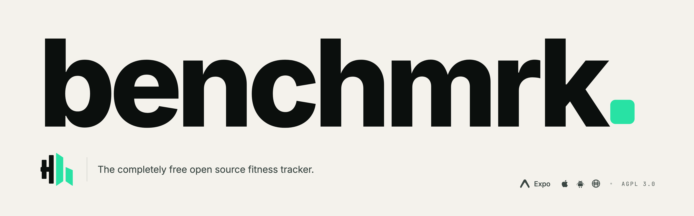

  
  
  
  

    
    
    
    
  

  
<strong>The open-source fitness tracker that respects your data.</strong> Track workouts, share progress, and own every byte — on iOS, Android, and the web.

## Why benchmrk

Modern fitness apps are great at one thing: locking you in.

- 🔒 **Your data, their servers.** Years of workouts, sets, and progress trapped behind paywalls and proprietary exports.
- 💸 **Subscriptions for the basics.** Logging a set shouldn't require a monthly fee. Neither should syncing across your own devices.
- 🧩 **Fragmented experience.** Workouts in one app, social in another, history nowhere. Nothing talks to anything else.

benchmrk is the alternative: a single tracker you can use for free, host yourself, audit line by line, and trust forever.

## What you get

- 🏋️ **Custom workouts** — Build training plans from a growing exercise catalog, or roll your own.
- ⏱️ **Live session tracking** — Log sets, reps, weight, and rest in real time, even offline.
- 📈 **Progress that's actually yours** — Every lift, every PR, exportable whenever you want.
- 👥 **Social feed** — Share completed sessions, cheer on friends, see what your network is lifting.
- ⚡ **Instant sync** — Powered by Convex; changes propagate to every device the moment they happen.
- 🌐 **Works everywhere** — Native iOS, native Android, and a full web app share one backend.
- 🏠 **Self-hostable** — Run the entire stack on your own infrastructure. No vendor lock-in, no telemetry, no surprises.

## Screenshots

| Workout Session | Exercise Catalog |  Social Feed  |
| :-------------: | :--------------: | :-----------: |
|  _coming soon_  |  _coming soon_   | _coming soon_ |

> Want to help? Drop screenshots into a PR — see [CONTRIBUTING.md](./CONTRIBUTING.md).

## Built with

A modern, fully typed stack chosen for speed of iteration and long-term maintainability.

| Layer      | Technology                                                         |
| ---------- | ------------------------------------------------------------------ |
| 📱 Mobile  | Expo SDK 54 · React Native · Expo Router · NativeWind · Reanimated |
| 🌐 Web     | Next.js 16 · React 19 · Tailwind CSS 4 · Radix UI                  |
| 🛰️ Backend | Convex (real-time DB + serverless functions) · Better Auth         |
| 🧰 Tooling | Turborepo · pnpm · Biome · TypeScript                              |

## Try it

The fastest way to use benchmrk is to install the app — public beta links land here once they're live.

In the meantime, you can run the full stack locally with a handful of commands. Setup, environment variables, and platform-specific notes live in **[CONTRIBUTING.md](./CONTRIBUTING.md)**.

## Roadmap

- [x] Workout creation and exercise catalog
- [x] Active session tracking — sets, reps, weights, duration
- [x] Social workout feed
- [x] Real-time multi-device sync
- [ ] Apple Health & Google Fit integration
- [ ] Strava cross-posting
- [ ] OAuth providers, 2FA, password reset
- [ ] Wearable companion (Apple Watch / Wear OS)
- [ ] Optional managed hosting tier (Stripe + RevenueCat)

Have an idea? [Open a discussion](https://github.com/fvnky07/benchmrk/discussions).

## Contributing

PRs, bug reports, and feature ideas are all welcome. If it's your first time here, start with **[CONTRIBUTING.md](./CONTRIBUTING.md)** — it covers local setup, the repo layout, scripts, architecture, branch and commit conventions, and the PR process.

- 💬 [Discussions](https://github.com/fvnky07/benchmrk/discussions) — design questions, ideas, "how do I…"
- 🐞 [Issues](https://github.com/fvnky07/benchmrk/issues) — confirmed bugs and concrete requests
- 🔐 [Security](https://github.com/fvnky07/benchmrk/security/advisories) — vulnerability disclosure (please don't open public issues)

## Acknowledgements

benchmrk stands on the shoulders of incredible open-source work:

- [Convex](https://convex.dev) for the reactive database that makes real-time feel free
- [Expo](https://expo.dev) and the React Native team for cross-platform native that doesn't suck
- [Next.js](https://nextjs.org) for a web framework that scales from landing page to product
- [Better Auth](https://better-auth.com) for honest, typed authentication
- [Turborepo](https://turborepo.dev), [pnpm](https://pnpm.io), [Biome](https://biomejs.dev) for the tooling that keeps the monorepo fast
- Everyone who has filed an issue, opened a PR, or starred the repo — thank you.

## License

benchmrk is released under the [GNU Affero General Public License v3.0 or later](./LICENSE).

You're free to use, study, modify, and self-host benchmrk. If you run a modified version as a network service, you must make your modifications available under the same license. Read the [LICENSE](./LICENSE) for the full terms.

---

  Built with ♥ for everyone who'd rather own their training data than rent it.

